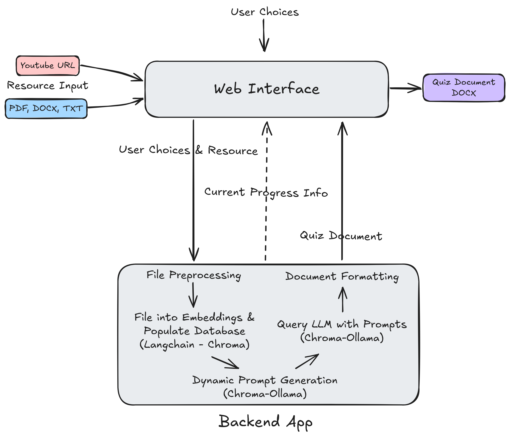

# EduQ: LLM Based Quiz Generation System



EduQ is an innovative web-based application that simplifies quiz creation using advanced AI techniques. Designed for educators, it leverages state-of-the-art language models to automate the generation of high-quality, context-aware quizzes, saving time and improving learning outcomes.

---

## Features

- **Powered by Advanced AI**: Utilizes **LLaMA 3.2: 3B** with **Ollama** integration to generate accurate and tailored quiz questions.
- **Retrieval-Augmented Generation (RAG)**: Employs a RAG system using **LangChain** and related libraries to retrieve relevant context from uploaded materials, ensuring quiz questions align with the source content.
- **Multiple Input Formats**: Supports **PDF, DOCX, TXT files**, and **YouTube URLs** for quiz material uploads.
- **Bloom’s Taxonomy Integration**: Generates questions across three educational levels (Easy, Medium, Hard), guided by Bloom's Taxonomy.
- **Dynamic User Configuration**: Allows customization of question types and difficulty levels with real-time validation to ensure accurate input.
- **Structured Output**: Provides standardized quiz formats for easy usage.
- **Responsive Web Application**: Ensures a smooth and user-friendly experience, with dynamic progress updates.

---

## Installation

### Step 1: Set Up Anaconda Environment

1. **Create a new Anaconda environment**:

   ```bash
   conda create --name eduq python=3.11
   conda activate eduq
   ```

2. **Install required packages**:

   ```bash
   pip install -r requirements.txt
   ```

### Step 2: Clone the Repository

   ```bash
   git clone https://github.com/eemreguven/EduQ.git
   cd EduQ
   ```

### Step 3: Run the Application

   ```bash
   python app.py
   ```

---

## Usage

1. **Access the Web Interface**:

   Open your web browser and navigate to `http://127.0.0.1:5000/`.

2. **Generate Quizzes**:

   - Upload educational content in supported formats (PDF, DOCX, TXT, or YouTube URL).
   - Configure quiz parameters, including question types and difficulty levels.
   - Submit your settings and receive the generated quiz.

---

## System Architecture

- **AI Model**: Utilizes **LLaMA 3.2: 3B** via Ollama for efficient and context-aware question generation.
- **RAG System**:
  - Integrates **LangChain**, **LangChain-Ollama**, and **LangChain-Chroma** to retrieve and process relevant content from uploaded materials.
  - Uses **LangChain-Text-Splitters** for document segmentation to enhance AI performance.
- **Prompt Design**:
  - Based on Bloom’s Taxonomy, with standardized question formats for Easy, Medium, and Hard difficulty levels.
  - Modular prompts to ensure consistency and scalability.

---

## Project Structure

```
EduQ/
├── app.py              # Main application logic
├── constants.py        # Predefined constants and settings
├── methods.py          # Core functions for file processing and quiz generation
├── progress.py         # Progress tracking utilities
├── requirements.txt    # List of required Python packages
├── templates/          # HTML templates for web pages
├── static/             # Static assets (CSS, JS, etc.)
└── rag-system/         # Retrieval-Augmented Generation components
```

---

## Dependencies

All dependencies are listed in `requirements.txt`. Below are the key libraries used:

- Flask
- PyPDF2
- pypdf
- python-docx
- reportlab
- youtube-transcript-api
- langchain
- langchain-ollama
- langchain-chroma
- langchain-community
- langchain-text-splitters
- Werkzeug

---

## Contributing

Contributions are welcome! Fork the repository, create a branch for your feature or fix, and submit a pull request.

---

## License

This project is licensed under the MIT License.

---

## Contact

For inquiries or support, please open an issue on the [GitHub repository](https://github.com/eemreguven/EduQ).

